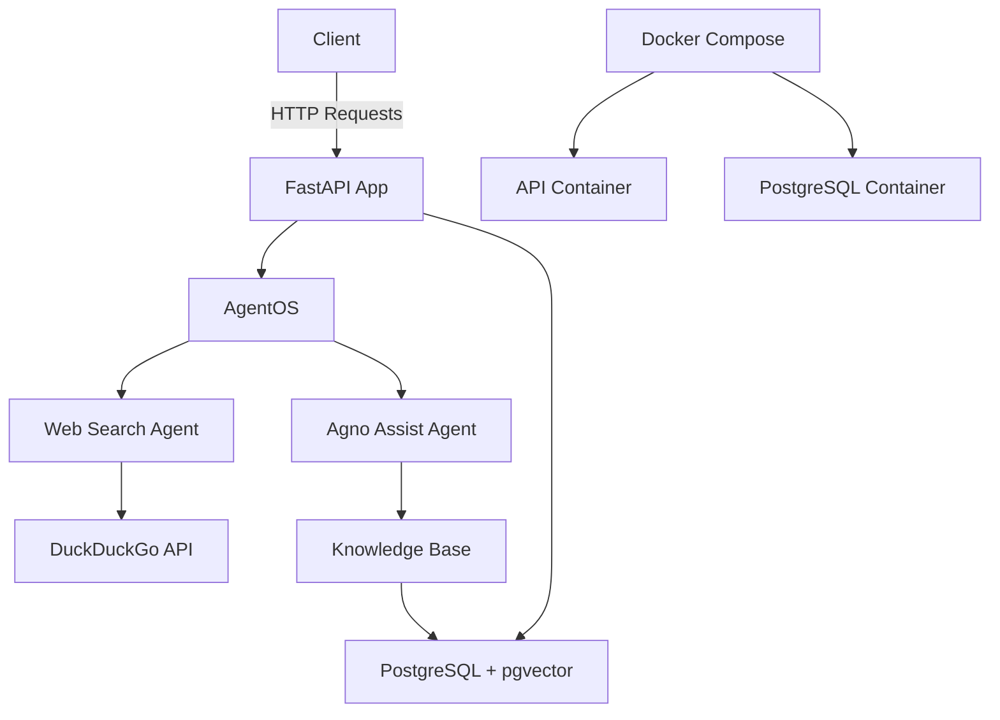

# AgenticOS - Complete Project Documentation

## Table of Contents
1. [Project Overview](#project-overview)
2. [Architecture](#architecture)
3. [Getting Started](#getting-started)
4. [Development Workflow](#development-workflow)
5. [Component Documentation](#component-documentation)
6. [Configuration](#configuration)
7. [Testing](#testing)
8. [Deployment](#deployment)
9. [Troubleshooting](#troubleshooting)

## Project Overview

**AgenticOS** is a Multi-Modal Retrieval-Augmented Generation (RAG) Agent system designed for intelligent knowledge querying across heterogeneous data sources. It provides a production-ready API infrastructure for deploying and managing AI agents.

### Key Features
- 🤖 **Pre-built AI Agents**: Web Search Agent and Agno Documentation Assistant
- 🧠 **RAG Capabilities**: Knowledge base with vector embeddings using pgvector
- 💾 **Persistent Memory**: Conversation history and agentic memory
- 🔌 **API-First**: FastAPI-based web service with OpenAPI documentation
- 🐳 **Docker Ready**: Complete containerized infrastructure
- 📊 **Vector Database**: PostgreSQL with pgvector for embedding storage

### Project Structure
```
AgenticOS/
├── agenticos/                 # Root Python package (v0.1.3)
├── agent-infra-docker/        # Docker infrastructure & application
│   ├── app/                  # FastAPI application
│   │   ├── main.py          # Application entry point
│   │   ├── agents/          # Agent implementations
│   │   └── db/              # Database configuration
│   ├── scripts/             # Development & deployment scripts
│   └── tests/               # Integration tests
└── configuration files      # .env, .mcp.json, pyproject.toml
```

## Architecture

### Technology Stack
- **Python 3.12+** - Primary programming language
- **Agno Framework 2.0.4** - AI agent framework foundation
- **FastAPI** - Web API framework
- **PostgreSQL + pgvector** - Vector database for embeddings
- **Docker & Docker Compose** - Containerization
- **OpenAI/Google Gemini** - Language model providers
- **DuckDuckGo API** - Web search capabilities
- **uv** - Python package manager

### System Architecture


### Agent Architecture
Each agent follows a consistent pattern:
- **Model Integration**: OpenAI or Google Gemini models
- **Tool Access**: Web search, knowledge base search
- **Memory Management**: Conversation history and user preferences
- **Knowledge Base**: Vector embeddings for relevant information retrieval

## Getting Started

### Prerequisites
- Docker Desktop (running)
- OpenAI API key
- Python 3.12+ (for local development)
- uv package manager

### Quick Start (Docker)
1. **Clone and Setup**
   ```bash
   git clone <repository-url>
   cd AgenticOS/agent-infra-docker
   ```

2. **Configure Environment**
   ```bash
   export OPENAI_API_KEY="your-api-key-here"
   ```

3. **Start Services**
   ```bash
   docker compose up -d --build
   ```

4. **Access API**
   - API Documentation: http://localhost:8000/docs
   - Health Check: http://localhost:8000/health
   - Agents List: http://localhost:8000/agents

### Local Development Setup
1. **Install uv**
   ```bash
   curl -LsSf https://astral.sh/uv/install.sh | sh
   ```

2. **Development Environment**
   ```bash
   cd agent-infra-docker
   ./scripts/dev_setup.sh
   source .venv/bin/activate
   ```

3. **Run Application**
   ```bash
   uvicorn app.main:app --reload
   ```

## Development Workflow

### Code Quality Standards
- **Formatting**: Ruff (120 character line length)
- **Type Checking**: MyPy with strict settings
- **Testing**: pytest with integration tests
- **Import Organization**: Automatic with ruff

### Essential Commands
```bash
# Format code
./scripts/format.sh

# Run tests
./scripts/run_tests.sh

# Type check
mypy .

# Generate requirements
./scripts/generate_requirements.sh
```

### Task Completion Checklist
Before committing code, ensure:
- [ ] Code formatted with ruff
- [ ] Type checking passes (mypy)
- [ ] All tests pass
- [ ] Docker build succeeds
- [ ] API endpoints respond correctly
- [ ] No sensitive data in commits

## Component Documentation

### 1. Web Search Agent (`app/agents/web_agent.py`)

**Purpose**: General-purpose web search with cited responses

**Capabilities**:
- DuckDuckGo web search integration
- Conversation history maintenance
- Source citation for responses
- Multi-source information cross-referencing

**Usage Example**:
```python
from app.agents.web_agent import get_web_agent

agent = get_web_agent(model_id="gemini-2.5-flash")
response = agent.run("What's the latest news in AI?", user_id="user123")
```

### 2. Agno Assist Agent (`app/agents/agno_assist.py`)

**Purpose**: Specialized assistant for Agno framework documentation

**Capabilities**:
- Knowledge base search with hybrid retrieval
- Code example generation
- Framework-specific guidance
- Technical documentation assistance

**Knowledge Integration**:
- Vector embeddings (OpenAI text-embedding-3-small)
- PostgreSQL storage with pgvector
- Automatic content loading from documentation URLs

### 3. Database Layer (`app/db/`)

**Components**:
- **session.py**: Database connection and session management
- **url.py**: Database URL construction utilities

**Configuration**:
```python
# Environment variables
DB_HOST=localhost
DB_PORT=5432
DB_USER=ai
DB_PASS=ai
DB_DATABASE=ai
```

### 4. Application Entry Point (`app/main.py`)

**Responsibilities**:
- AgentOS instance creation
- Agent registration and configuration
- FastAPI app initialization
- Async knowledge base loading

## Configuration

### Environment Variables
| Variable | Description | Default |
|----------|-------------|---------|
| `OPENAI_API_KEY` | OpenAI API key (required) | - |
| `DB_HOST` | Database host | localhost |
| `DB_PORT` | Database port | 5432 |
| `DB_USER` | Database user | ai |
| `DB_PASS` | Database password | ai |
| `DB_DATABASE` | Database name | ai |

### Agent Configuration (`app/config.yaml`)
```yaml
chat:
  quick_prompts:
    web-search-agent:
      - "What can you do?"
      - "What is currently happening in France?"
    agno-assist:
      - "What can you do?"
      - "Tell me about Agno's AgentOS"
```

### MCP Configuration (`.mcp.json`)
```json
{
  "mcpServers": {
    "Agno": {
      "name": "Agno",
      "url": "https://docs.agno.com/mcp",
      "headers": {}
    }
  }
}
```

## Testing

### Test Structure
```
tests/
├── conftest.py          # pytest fixtures and configuration
├── test_health.py       # Health check tests
└── test_agents.py       # Agent functionality tests
```

### Running Tests
```bash
# Full test suite
./scripts/run_tests.sh

# Specific test types
./scripts/run_tests.sh health    # Health checks only
./scripts/run_tests.sh agents    # Agent tests only
./scripts/run_tests.sh fast      # Exclude slow tests

# Manual pytest (with running containers)
pytest tests/ -v
```

### Test Examples
```python
def test_web_agent_search_query(api_client):
    """Test web agent with search query."""
    form_data = {"message": "What is the weather in NYC?", "user_id": "test_user"}
    response = api_client.post("/agents/web-search-agent/runs", data=form_data)
    assert response.status_code == 200
    assert "content" in response.json()
```

## Deployment

### Docker Deployment
1. **Build Image**
   ```bash
   ./scripts/build_image.sh
   ```

2. **Production Environment**
   ```bash
   # Set production variables
   export IMAGE_NAME=your-registry/agenticos
   export IMAGE_TAG=v1.0.0
   
   # Deploy
   docker compose up -d
   ```

### Cloud Deployment Options
- **Google Cloud Run**: Serverless container platform
- **AWS App Runner**: Managed container service
- **Azure Container Apps**: Serverless containers
- **Kubernetes**: EKS, GKE, AKS for orchestration

### Database Considerations
- Use managed database services in production
- Configure connection pooling
- Set up backup and monitoring
- Use connection secrets management

## Troubleshooting

### Common Issues

**1. Database Connection Errors**
```bash
# Check database status
docker compose ps
docker compose logs pgvector

# Verify environment variables
echo $DB_HOST $DB_PORT $DB_USER
```

**2. API Key Issues**
```bash
# Verify API key is set
echo $OPENAI_API_KEY

# Check in container
docker compose exec api env | grep OPENAI
```

**3. Agent Not Responding**
```bash
# Check agent registration
curl http://localhost:8000/agents

# View application logs
docker compose logs api
```

**4. Test Failures**
```bash
# Ensure containers are running
docker compose up -d

# Check test dependencies
source .venv/bin/activate
pytest --version
```

### Performance Optimization
- Use connection pooling for database
- Implement caching for frequent queries
- Monitor memory usage in containers
- Configure model timeout settings

### Debugging
```bash
# Enable debug mode
export DEBUG_MODE=true

# View detailed logs
docker compose logs -f api

# Access container shell
docker compose exec api bash
```

## Additional Resources

### Documentation Links
- [Agno Framework Docs](https://docs.agno.com)
- [FastAPI Documentation](https://fastapi.tiangolo.com)
- [pgvector Documentation](https://github.com/pgvector/pgvector)

### Community & Support
- [Agno Discord](https://agno.link/discord)
- [Agno Community Forum](https://agno.link/community)
- [GitHub Issues](https://github.com/agno-agi/agent-api/issues)

### Example Integrations
- Connect to Agno UI: https://os.agno.com
- API endpoint: http://localhost:8000
- WebSocket support for real-time interactions

---

*Generated by Claude Code for AgenticOS project documentation*